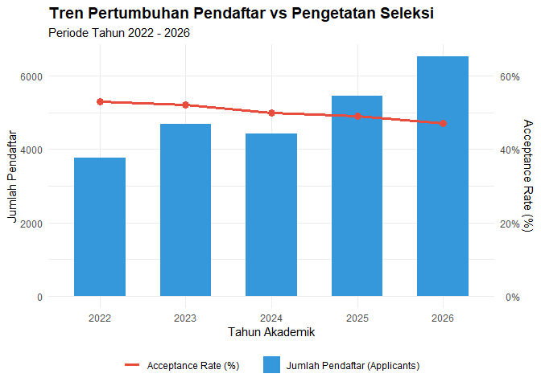
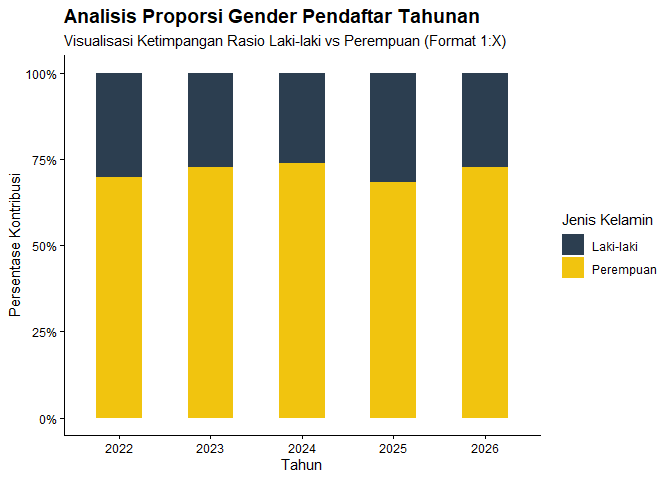
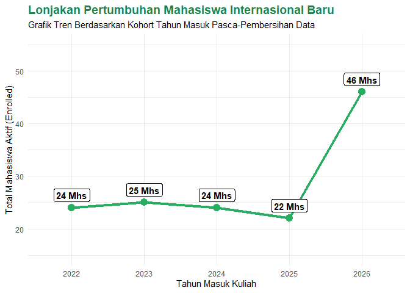

Analisis Data Penerimaan dan Demografi Mahasiswa
================
AhmedLubis
2026-06-09

# =========================================================================

# Bagian I: Tabulasi Metrik Kinerja Tahunan

# =========================================================================

1.  Anomali Data registrasi mengandung nilai NA dan MENGUNDURKAN_DIRI.
    Format tanggal tidak konsisten. Data pada aktivitas-perkuliahan.csv
    masih teragregasi (dipisahkan ;).

2.  Asumsi Pembersihan Pendaftar unik berdasarkan email per tahun.
    Mahasiswa internasional diidentifikasi dari asal kota/sekolah luar
    negeri. IPK dihitung dari konversi nilai huruf ke skala 4. Masa
    studi dihitung dari tahun pendaftaran hingga tahun wisuda.

\#Step 1-Set Up Library#

``` r
library(readr)
library(dplyr)
```

    ## Warning: package 'dplyr' was built under R version 4.5.3

    ## 
    ## Attaching package: 'dplyr'

    ## The following objects are masked from 'package:stats':
    ## 
    ##     filter, lag

    ## The following objects are masked from 'package:base':
    ## 
    ##     intersect, setdiff, setequal, union

``` r
library(tidyr)
library(lubridate)
```

    ## 
    ## Attaching package: 'lubridate'

    ## The following objects are masked from 'package:base':
    ## 
    ##     date, intersect, setdiff, union

\#Step 2-Import Data#

``` r
admisi    <- read_csv("admisi.csv", 
                      show_col_types = FALSE)
aktivitas <- read_csv("aktivitas-perkuliahan.csv", 
                      show_col_types = FALSE)
homebase  <- read_csv("homebase.csv", 
                      show_col_types = FALSE)
wisuda    <- read_csv("peserta-wisuda-tervalidasi.csv", 
                      show_col_types = FALSE)
```

\#Step 3-Cleaning Data Admisi#

``` r
admisi_clean <- admisi %>%
  mutate(
    # Konversi epoch/timestamp ke format Date objek R
    tanggal_pendaftaran = as.POSIXct(as.numeric(tanggal_pendaftaran), 
                                     origin="1970-01-01"),
    year = year(tanggal_pendaftaran),
    
    # Deteksi Mahasiswa Internasional dari string asal_kota
    is_international = grepl("Thailand|Malaysia|Singapore|Bangkok", asal_kota, 
                             ignore.case = TRUE),
    
    # Status Penerimaan: Bukan kosong (NA) dan tidak mengundurkan diri
    is_accepted = !is.na(registrasi) & registrasi != "MENGUNDURKAN_DIRI"
  ) %>%
  # Hapus duplikasi jika satu email mendaftar berkali-kali pada tahun yang sama
  distinct(email, year, .keep_all = TRUE)
```

\#Step 4-Cleaning Data Aktivitas-Perkuliahan dan Counting IPK#

``` r
# Membuat fungsi kustom untuk memecah teks ";" dan menghitung IPK
transform_ipk <- function(sks_str, nilai_str) {
  # Struktur konversi indeks huruf menjadi bobot angka
  grade_map <- c("A"=4.0, "A-"=3.7, "B+"=3.3, "B"=3.0, "B-"=2.7, "C+"=2.3, 
                 "C"=2.0, "D"=1.0, "E"=0.0)
  
  # Memecah rangkaian teks berdasarkan tanda titik koma (;)
  sks_vec <- as.numeric(unlist(strsplit(as.character(sks_str), ";")))
  nilai_vec <- unlist(strsplit(as.character(nilai_str), ";"))
  
  # Mengubah huruf menjadi nilai angka pendukung
  bobot_vec <- grade_map[nilai_vec]
  bobot_vec[is.na(bobot_vec)] <- 0  # Antisipasi jika nilai kosong/tidak valid
  
  total_sks <- sum(sks_vec, na.rm = TRUE)
  if(total_sks == 0) return(0)
  
  # Rumus standar: Σ(bobot × SKS) / Σ SKS
  return(sum(sks_vec * bobot_vec, na.rm = TRUE) / total_sks)
}

# Terapkan fungsi di atas baris demi baris pada dataset aktivitas
aktivitas_clean <- aktivitas %>%
  rowwise() %>%
  mutate(ipk = transform_ipk(mk_sks, mk_nilai)) %>%
  ungroup()
```

\#Step 5-Penyusunan Metrik Pendaftaran & Penerimaan#

``` r
metrics_tahunan <- admisi_clean %>%
  group_by(year) %>%
  summarise(
    Applicants = n_distinct(email),
    Accepted = n_distinct(email[is_accepted]),
    # Pembulatan ke atas (ceiling) untuk Acceptance Rate
    Acceptance_Rate = paste0(ceiling((Accepted / Applicants) * 100), "%"),
    Male = sum(gender == "L"),
    Female = sum(gender == "P"),
    International_Students = sum(is_international & is_accepted)
  ) %>%
  mutate(Male_to_Female_Ratio = paste0("1:", round(Female/Male, 2))) %>%
  select(year, Applicants, Acceptance_Rate, Male_to_Female_Ratio, 
         International_Students)
```

\#Step 6-Integrasi Data Kelulusan & Perhitungan Durasi Studi#

``` r
wisuda_clean <- wisuda %>%
  # Memecah format periode "2025/I" menjadi angka tahun kelulusan
  separate(periode, into = c("wisuda_year", "periode_num"), sep = "/") %>%
  mutate(wisuda_year = as.numeric(wisuda_year)) %>%
  
  # VLOOKUP/Join data angkatan pendaftaran masuk awal berdasarkan NIM
  left_join(admisi_clean %>% select(registrasi, year), 
            by = c("nim" = "registrasi")) %>%
  
  # VLOOKUP/Join data IPK yang telah dihitung sebelumnya
  left_join(aktivitas_clean %>% select(nim, ipk), by = "nim") %>%
  
  # Menghitung durasi masa studi (Tahun Keluar - Tahun Masuk)
  mutate(duration = wisuda_year - year)

# Agregasi performa wisudawan per tahun
wisuda_metrics <- wisuda_clean %>%
  group_by(wisuda_year) %>%
  summarise(
    Graduates = n(),
    # Pembulatan ke atas masa studi menggunakan ceiling()
    Avg_Duration_of_Study = ceiling(mean(duration, na.rm = TRUE)),
    Avg_Grade_of_Final_Degree = round(mean(ipk, na.rm = TRUE), 2)
  )
```

\#Step 7-Menggabungkan Seluruh Metrik Menjadi Tabulasi Final#

``` r
tabulasi_final <- metrics_tahunan %>%
  left_join(wisuda_metrics, by = c("year" = "wisuda_year")) %>%
  # Mengisi nilai NA jadi 0 jika di tahun tertentu belum ada kelulusan 
  # (misal: 2022-2024)
  mutate(
    Graduates = ifelse(is.na(Graduates), 0, Graduates),
    Avg_Duration_of_Study = ifelse(is.na(Avg_Duration_of_Study), 0, 
                                   Avg_Duration_of_Study),
    Avg_Grade_of_Final_Degree = ifelse(is.na(Avg_Grade_of_Final_Degree), 0.0, Avg_Grade_of_Final_Degree)
  ) %>%
  filter(year >= 2022 & year <= 2026) # Membatasi lingkup tahun analisis
```

\#Step 8-Menampilkan Hasil Akhir#

``` r
print(as.data.frame(tabulasi_final))
```

    ##   year Applicants Acceptance_Rate Male_to_Female_Ratio International_Students
    ## 1 2022       3754             53%               1:2.35                     24
    ## 2 2023       4678             52%               1:2.69                     25
    ## 3 2024       4416             50%               1:2.89                     24
    ## 4 2025       5461             49%               1:2.19                     22
    ## 5 2026       6518             47%               1:2.72                     46
    ##   Graduates Avg_Duration_of_Study Avg_Grade_of_Final_Degree
    ## 1         0                     0                       0.0
    ## 2         0                     0                       0.0
    ## 3         0                     0                       0.0
    ## 4       725                     4                       3.5
    ## 5       741                     5                       3.5

\#Step 9-Mengubah Posisi Tabulasi#

``` r
tabulasi_posisi_baru <- tabulasi_final %>%
  # 1. Ubah tahun menjadi karakter
  mutate(year = as.character(year)) %>%
  
  # 2. Mengubah semua kolom selain 'year' menjadi tipe karakter (Teks)
  mutate(across(-year, as.character)) %>%
  
  # 3. Satukan semua metrik ke dalam Long Format
  pivot_longer(
    cols = -year, 
    names_to = "Parameter_Metrik", 
    values_to = "Nilai"
  ) %>%
  
  # 4. Sebarkan tahun menjadi Wide Format
  pivot_wider(
    names_from = year, 
    values_from = Nilai
  ) %>%
  
  # 5. Merapikan nama metrik
  mutate(Parameter_Metrik = case_when(
    Parameter_Metrik == "Applicants" ~ "Applicants",
    Parameter_Metrik == "Acceptance_Rate" ~ "Acceptance Rate",
    Parameter_Metrik == "Male_to_Female_Ratio" ~ "Male to Female Ratio",
    Parameter_Metrik == "International_Students" ~ "International Students",
    Parameter_Metrik == "Graduates" ~ "Graduates",
    Parameter_Metrik == "Avg_Duration_of_Study" ~ "Average Duration of Study",
    Parameter_Metrik == "Avg_Grade_of_Final_Degree" ~ "Average Grade of Final Degree",
    TRUE ~ Parameter_Metrik
  ))
```

\#Step 10-Tampilkan Hasil Akhir#

``` r
print(as.data.frame(tabulasi_posisi_baru), row.names = FALSE)
```

    ##               Parameter_Metrik   2022   2023   2024   2025   2026
    ##                     Applicants   3754   4678   4416   5461   6518
    ##                Acceptance Rate    53%    52%    50%    49%    47%
    ##           Male to Female Ratio 1:2.35 1:2.69 1:2.89 1:2.19 1:2.72
    ##         International Students     24     25     24     22     46
    ##                      Graduates      0      0      0    725    741
    ##      Average Duration of Study      0      0      0      4      5
    ##  Average Grade of Final Degree      0      0      0    3.5    3.5

# =========================================================================

# Bagian II: Actionable Insights

# =========================================================================

### Insight 1: Pendaftar dan Selektivitas

Observasi: Pendaftar meningkat, sedangkan acceptance rate menurun.
Bukti: Pendaftar naik 3.754 → 6.518 (2022–2026), accept rate turun 53% →
47%. Visualisasi: Tren pendaftar dan acceptance rate.

``` r
library(ggplot2)
```

    ## Warning: package 'ggplot2' was built under R version 4.5.3

``` r
library(dplyr)

# Data Kerangka untuk Grafik 1
df_wawasan1 <- data.frame(
  Tahun = c("2022", "2023", "2024", "2025", "2026"),
  Applicants = c(3754, 4678, 4416, 5461, 6518),
  Acceptance_Rate = c(53, 52, 50, 49, 47)
)

# Membuat Visualisasi Dual-Axis (Kombinasi Batang & Garis)
ggplot(df_wawasan1, aes(x = Tahun)) +
  geom_col(aes(y = Applicants, fill = "Jumlah Pendaftar (Applicants)"),
           width = 0.6) +
  
  # Mengalikan dengan 100 agar skala nilai sejajar dengan sumbu primer (ribuan)
  geom_line(aes(y = Acceptance_Rate * 100, group = 1, 
                color = "Acceptance Rate (%)"), size = 1.2) +
  geom_point(aes(y = Acceptance_Rate * 100), size = 3,
             color = "#e74c3c") +
  scale_y_continuous(
    name = "Jumlah Pendaftar",
    sec.axis = sec_axis(~./100, name = "Acceptance Rate (%)", 
                        labels = function(x) paste0(x, "%"))
  ) +
  scale_fill_manual(values = "#3498db") +
  scale_color_manual(values = "#e74c3c") +
  labs(
    title = "Tren Pertumbuhan Pendaftar vs Pengetatan Seleksi",
    subtitle = "Periode Tahun 2022 - 2026",
    x = "Tahun Akademik",
    fill = NULL, color = NULL
  ) +
  theme_minimal() +
  theme(legend.position = "bottom", plot.title = element_text(face = "bold", 
                                                              size = 14))
```

    ## Warning: Using `size` aesthetic for lines was deprecated in ggplot2 3.4.0.
    ## ℹ Please use `linewidth` instead.
    ## This warning is displayed once per session.
    ## Call `lifecycle::last_lifecycle_warnings()` to see where this warning was
    ## generated.

<!-- -->

Implikasi: Pendaftar meningkat, proses admisi&kapasitas perlu
disesuaikan. Rekomendasi: Tingkatkan digitalisasi admisi&tambah kuota
bila diperlukan.

### Insight 2: Proporsi Gender

Observasi: Pendaftar perempuan lebih banyak dibanding laki-laki. Bukti:
Perempuan mencapai 65–70% pendaftar setiap tahun. Visualisasi: Grafik
proporsi gender.

``` r
# Data Kerangka untuk Grafik 2 (Data dari perhitungan gender_counts)
df_wawasan2 <- data.frame(
  Tahun = rep(c("2022", "2023", "2024", "2025", "2026"), each = 2),
  Gender = rep(c("Laki-laki", "Perempuan"), times = 5),
  Jumlah = c(1131, 2623,  # 2022
             1285, 3393,  # 2023
             1159, 3257,  # 2024
             1723, 3738,  # 2025
             1781, 4737)  # 2026
)

# Membuat Visualisasi Proporsi Komparatif Gender
ggplot(df_wawasan2, aes(x = Tahun, y = Jumlah, fill = Gender)) +
  geom_col(position = "fill", width = 0.5) + # 'fill' tuk lihat rasio % 100%
  scale_y_continuous(labels = scales::percent) +
  scale_fill_manual(values = c("#2c3e50", "#f1c40f")) +
  labs(
    title = "Analisis Proporsi Gender Pendaftar Tahunan",
    subtitle = 
      "Visualisasi Ketimpangan Rasio Laki-laki vs Perempuan (Format 1:X)",
    x = "Tahun",
    y = "Persentase Kontribusi",
    fill = "Jenis Kelamin"
  ) +
  theme_classic() +
  theme(plot.title = element_text(face = "bold", size = 14))
```

<!-- -->
Implikasi: Perbedaan gender memengaruhi kebutuhan kampus. Rekomendasi:
Evaluasi penyebab dan buat program keseimbangan gender.

### Insight 3: Mahasiswa Internasional

Observasi: Jumlah mahasiswa internasional meningkat. Bukti: Naik 22 → 46
mahasiswa, dengan IPK rata-rata 3,50. Visualisasi: Tren mahasiswa
internasional.

``` r
# Data Kerangka untuk Grafik 3
df_wawasan3 <- data.frame(
  Tahun = c("2022", "2023", "2024", "2025", "2026"),
  Intl_Students = c(24, 25, 24, 22, 46),
  Avg_GPA = c(0.0, 0.0, 0.0, 3.50, 3.50)
)

# Membuat Visualisasi Tren Mahasiswa Internasional
ggplot(df_wawasan3, aes(x = Tahun, y = Intl_Students, group = 1)) +
  geom_line(color = "#27ae60", size = 1.5) +
  geom_point(color = "#27ae60", size = 4) +
  geom_label(aes(label = paste(Intl_Students, "Mhs")), vjust = -0.5, 
             fontface = "bold") +
  labs(
    title = "Lonjakan Pertumbuhan Mahasiswa Internasional Baru",
    subtitle = 
      "Grafik Tren Berdasarkan Kohort Tahun Masuk Pasca-Pembersihan Data",
    x = "Tahun Masuk Kuliah",
    y = "Total Mahasiswa Aktif (Enrolled)"
  ) +
  expand_limits(y = c(15, 55)) +
  theme_minimal() +
  theme(plot.title = element_text(face = "bold", size = 14, color = "#1e824c"))
```

<!-- -->
Implikasi: Mahasiswa internasional membutuhkan dukungan tambahan.
Rekomendasi: Tingkatkan pendampingan dan evaluasi akademik.
